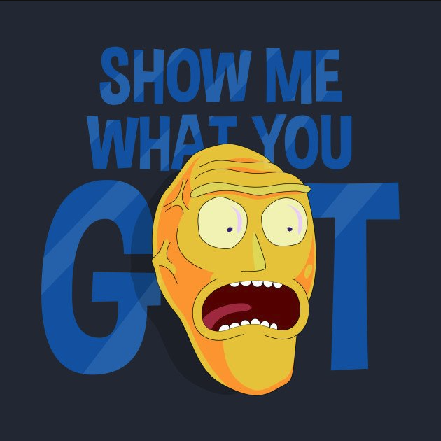

# dchain
**dchain** is a blockchain built using Cosmos SDK and Tendermint



Get DCHAIN

https://www.youtube.com/watch?v=I1188GO4p1E

## Get started

Install [go](https://go.dev/dl/)

## Build and install to go bin path

```
make install
```

## Initialize config

Come up with a moniker for your node, then run:

```
dchaind init $MONIKER
```

## Available commands

```
Usage:
  dchaind tx whiteboard [flags]
  dchaind tx whiteboard [command]

Available Commands:
  create-whiteboard          Broadcast message create-whiteboard
  lock-whiteboard            Broadcast message lock-whiteboard
  set-whiteboard-pixel-color Broadcast message set-whiteboard-pixel-color
  unlock-whiteboard          Broadcast message unlock-whiteboard

```


## Create a NFT collection

```
Use:   "create-collection [name] [description] [ticker] [uri] [uri-hash] [data]"
Short: "Create a new collection"
```

## Create new NFT within a collection

```
Use:   "create-nft [collection-id] [uri] [uri-hash] [data]"
Short: "Create a new nft"
``` 
 
## Launch with genesis file or run as standalone chain

To launch as a consumer chain, download and save shared genesis file to `~/.dchain/config/genesis.json`. Additionally add peering information (`persistent_peers` or `seeds`) to `~/.dchain/config/config.toml`

To instead launch as a standalone, single node chain, run:

```
dchaind add-consumer-section
```

## Launch node

```
dchaind start
```
